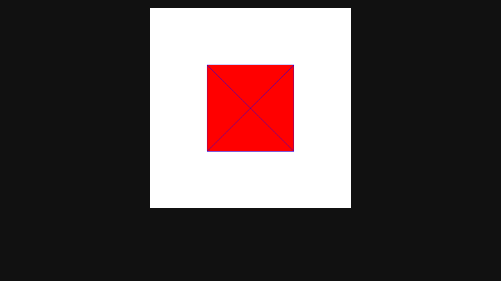
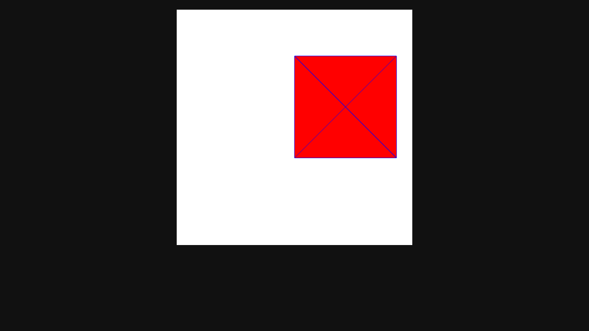
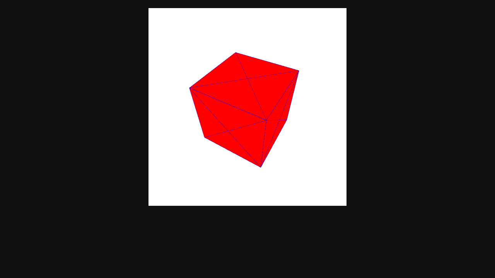
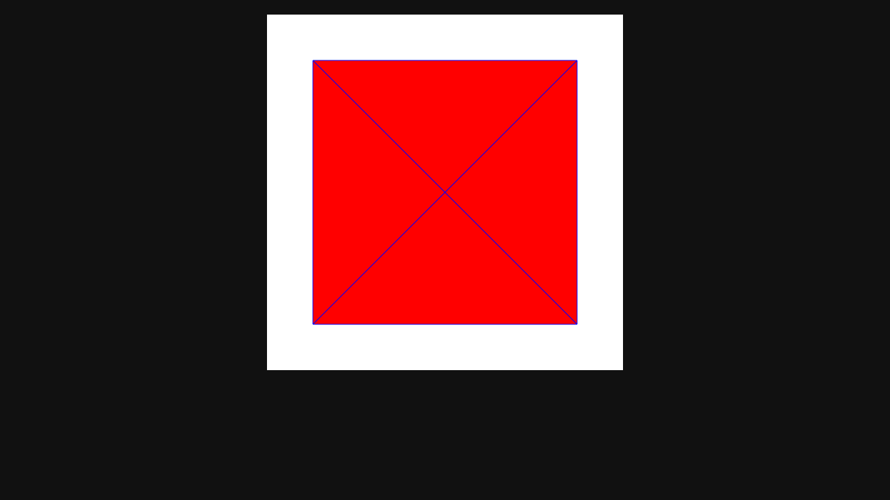
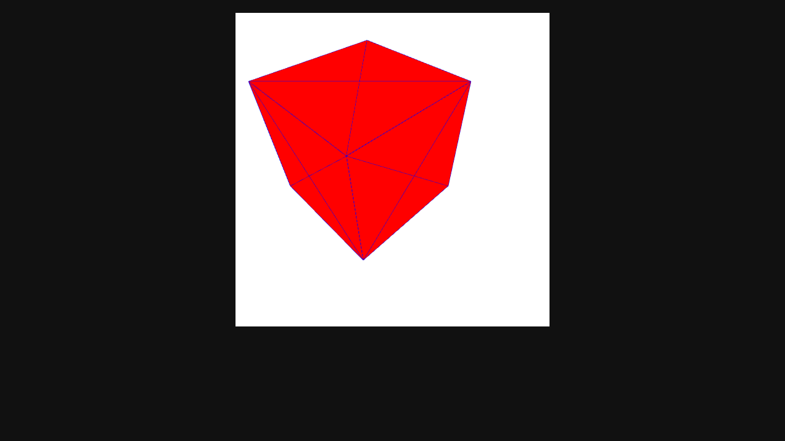

# Lab 5: Interactive Controls & Screenshots

### Interactive Keyboard Controls
Program successfully binds event listeners corresponding to interaction steps matching lab instructions
- **`W`/`S`**: Move up/down (Y-axis translation)
- **`A`/`D`**: Move left/right (X-axis translation)
- **`R`/`F`**: Move forward/backward (Z-axis translation)
- **`↑`/`↓`**: Rotate around X-axis (`ArrowUp`/`ArrowDown`)
- **`←`/`→`**: Rotate around Y-axis (`ArrowLeft`/`ArrowRight`)
- **`Q`/`E`**: Rotate around Z-axis
- **`T`/`G`**: Scale enlarge / shrink

## Results & Screenshots

Using defined architecture, here are outputs of visual WebGL application mapping 8 corners into a solid and wireframed cube via `gl.TRIANGLES` and `gl.LINES`:

### Initial State
At its true initial state (`tz=-5.0`, `rotX=0`, `rotY=0`, `rotZ=0`), camera looks exactly down Z-axis perfectly perpendicular to front face of cube. Because there is no rotation yet, 3D cube perfectly overlaps with itself and appears as a precise flat 2D square.

### Translation
Translation shifts position of cube without changing its topology or rotation. (Example: Moving top-right using `tx=1.0, ty=0.4`)

### Rotation
Applying rotational logic tilts matrix. Here cube rotates along both X and Y axes (`rotX=45°`, `rotY=-30°`), allowing us to examine its geometry.

### Scaling
By holding `T` key, dimension uniformly scales across all geometry vertices (`scale=1.5`).

### Combined Transformation
Applying translation, rotation, and scaling concurrently dynamically computes an accurate coordinate matrix!

